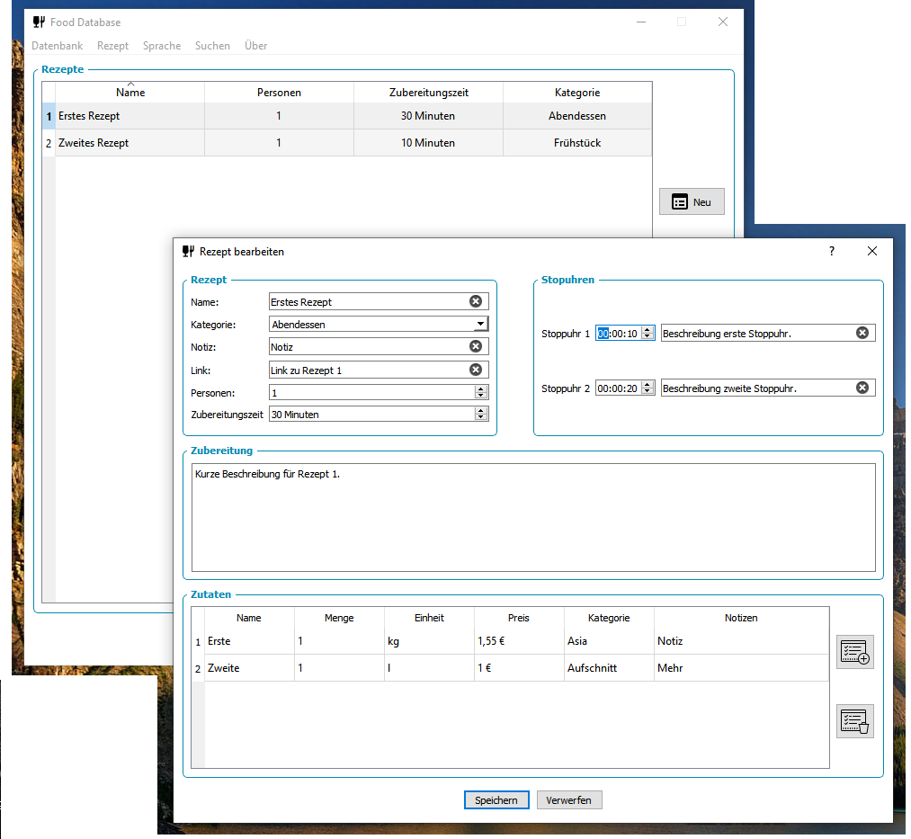

# Food Database

## Table of Contents

- [Food Database](#food-database)
  - [Table of Contents](#table-of-contents)
  - [About](#about)
  - [Supported Apps](#supported-apps)
  - [Image sources](#image-sources)
  - [History](#history)
  - [Maintainer](#maintainer)

## About

Organize your cooking recipes with your computer or with your tablet and export the recipes for your Android or iOS smartphone.

## Supported Apps

The Food Database support file formats for the following Android or iOS apps:

- [2in1 Rezept- und Einkaufsliste](https://play.google.com/store/apps/details?id=de.d_vincenz.simpleshoppinglist&hl=de)

## Image sources

- [Language Icons](https://www.iconfinder.com/iconsets/flags_gosquared)
- [Button and Menu Icons](https://material.io/)

## History

| **Version**  | **Description**                            | **Date**   |
|:------------:|:------------------------------------------:|:----------:|
| 1.0          | Initial release                            | 10.02.2020 |
| 1.1          | Add multi language support                 | 12.02.2020 |
| 1.2          | Add installer, add category editing        | 22.02.2020 |

## Maintainer

- [Daniel Kampert](mailto:DanielKampert@kampis-elektroecke.de)